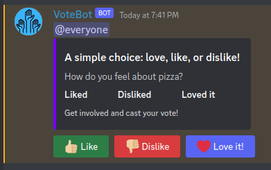
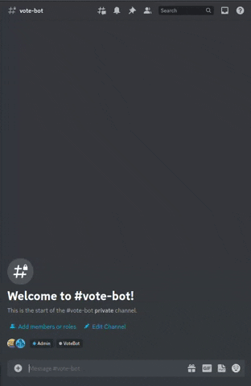
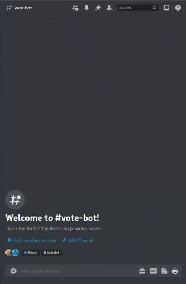
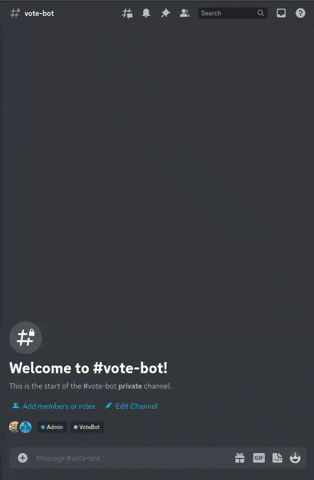

# VoteBot

  

VoteBot is a Discord bot that allows users to react to messages with "Like," "Dislike," or "Love it" and keeps track of
the users who have reacted to the messages.

## Features:

    - Users can interact with messages in the Discord channel by either liking, disliking, or loving a message.
    - The bot tracks the number of likes, dislikes, and loves for each message and displays them in a format that is easy to understand.
    - Users can only like, dislike, or love a message once, and the bot will inform them if they have already interacted with a message.

## Technical Details:

The bot is built using the `discord.py` library and utilizes the `discord.ext.commands` classe to handle interactions
within the Discord channel.
The bot stores information about the messages and user interactions in a global dictionary that is stored in memory. The
bot updates this information every time a user interacts with a message.
Deployment

## Usage:

The bot uses the following prefix to recognize commands: `!`
And has currently only one command `poll`

> **NOTE:** The bot sends `@everyone` mention for all polls!

### Text based poll:

To create a simple text based poll, you can type `!poll <TEXT>`

### Image based poll:

To create an image based poll, select the image you want to create poll about then type `!poll`.

optionally you can write a text to be shared with the image `!poll <TEXT>`.

> **Note:** If you put multiple images in one poll command, the text will be displayed on all images.

